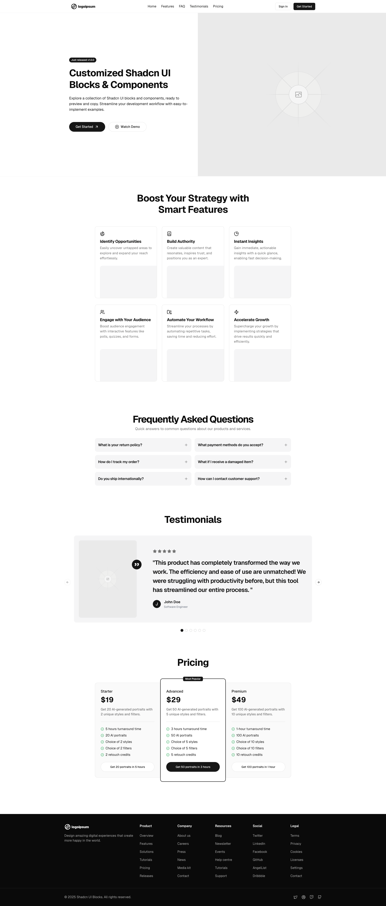

# Beautiful Shadcn UI Landing Page

A modern, responsive landing page template built with Next.js, Tailwind CSS, and Shadcn UI components.

## Demo

[Live Demo](https://shadcn-ui-landing-page.vercel.app/)

## Preview



## Features

- 🎨 Modern and clean design
- 📱 Fully responsive layout
- 🎯 Built with Next.js 15
- 💅 Styled with Tailwind CSS
- 🧩 Built with [Shadcn UI](https://ui.shadcn.com) and [Shadcn UI Blocks](https://shadcnui-blocks.com)

## Getting Started

1. Clone the repository:

```bash
git clone https://github.com/yourusername/beautiful-shadcn-ui-landing-page.git
cd beautiful-shadcn-ui-landing-page
```

2. Install dependencies:

```bash
npm install
# or
yarn install
# or
pnpm install
```

3. Start the development server:

```bash
npm run dev
# or
yarn dev
# or
pnpm dev
```

4. Open [http://localhost:3000](http://localhost:3000) in your browser to see the result.

## Customization

1. Replace the placeholder images with your own content.
2. Modify the text and styles in the components to match your brand and messaging.
3. Add your own features and sections as needed.

## Why this template?

This project is a base template for a landing page. It is built with Next.js, Tailwind CSS, Shadcn UI, and Shadcn UI Blocks. It is a great starting point for a landing page. You can customized the content and media files as per your needs. It is not intended to be a complete solution for a landing page. It is intended to be a starting point for a landing page.

## Contributing

If you have any suggestions or improvements, please create an issue or submit a pull request.
